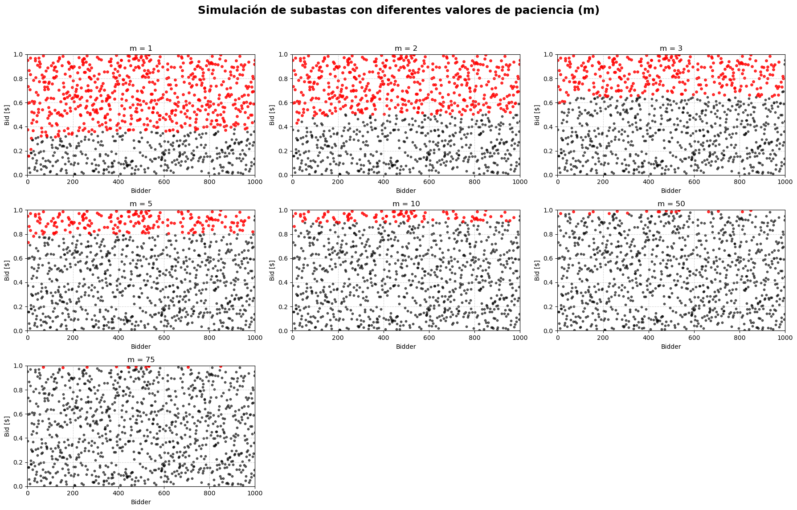
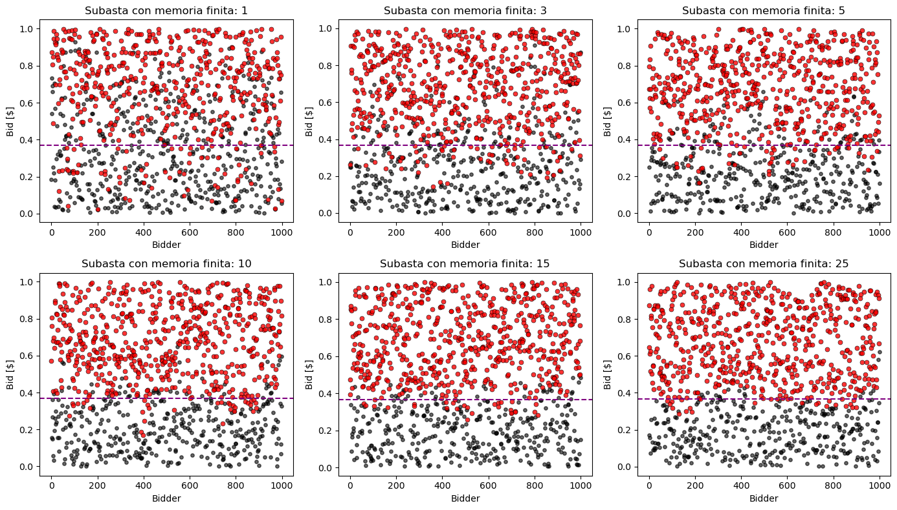
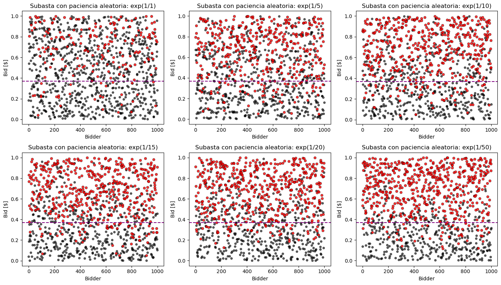

# README.md

## 1. Introducción

Este proyecto tiene como objetivo explorar, mediante simulaciones, el comportamiento de diferentes variantes del modelo de subasta con precio crítico desarrollado en Fraiman, D. (2022). El modelo original describe un mecanismo de subasta en el que el vendedor acepta la mejor oferta bajo ciertas reglas de paciencia y memoria, lo que da lugar a la aparición de un "precio crítico" característico.

En este trabajo se busca implementar una serie de modificaciones que tienen como objetivo analizar el impacto de distintos supuestos sobre el resultado de la subasta. El trabajo permite comparar los resultados empíricos obtenidos por simulación con los resultados teóricos, y entender cómo la dinámica de la subasta se ve afectada por cambios en las reglas de juego.

## 2. Modificaciones y variantes implementadas

A continuación se detallan las distintas variantes del modelo que fueron implementadas y analizadas en este trabajo.

### 2.1 Modelo original SOC

Se implementa el modelo base propuesto en Fraiman, D. (2022), en el cual el vendedor recibe ofertas de forma secuencial, aceptando la oferta si es mayor a todas las ofertas que la preceden pero también mayor a la oferta posterior.

Este proceso es continuo en el tiempo, es decir, no hay una fecha límite para realizar las ofertas, lo que deriva en la aparición de un precio crítico que depende tanto de la distribución de las ofertas y de la regla de aceptación. Si la oferta es mayor a este precio, entonces tiene altas probabilidades de ser aceptada, y si es menor muy probablemente no lo sea.

Esta modelo lo utilizamos como punto de partida y referencia para comparar el efecto de las modificaciones posteriores.

### 2.2 Paciencia finita del vendedor

Se modifica el parámetro de paciencia, $m$, el cual representa la cantidad de ofertas consecutivas que el vendedor está dispuesto a esperar antes de aceptar la oferta máxima. Es decir, el vendedor acepta la oferta únicamente si las $m$ ofertas posteriores son de menor valor.

En Fraiman, D. (2022) el parámetro de paciencia está definido como $m=1$, lo que quiere decir que la oferta se acepta solo si el precio de la siguiente oferta es menor. Modificar este parámetro nos permite analizar cómo la paciencia del vendedor influye en el precio crítico de venta y en la eficiencia del mecanismo de subasta. Se exploran diferentes valores de $m$ para observar su impacto en los resultados.

#### 2.2.1 Algoritmo

```pseudocode
INPUT: 
    bids[] - lista con las ofertas generadas
    m - máxima cantidad de ofertas que el vendedor está dispuesto a esperar

VARIABLES:
    accepted_bids[] - lista con las ofertas aceptadas
    non_accepted_bids[] - lista con las ofertas rechazadas
    pending_bids[] - lista con las ofertas pendientes
    max_bid - mejor oferta hasta el momento
    counter - cantidad de ofertas desde que se generó la mejor
    
BEGIN
    FOR EACH bid IN bids[] DO
        // Step 1: Iterate over each generated offer
        
        // Step 2: Add the offer to the pending list
        ADD bid TO pending_bids[]
        
        // Step 3: If there is more than one pending offer
        IF SIZE(pending_bids) > 1 THEN
            // Step 3.1: Find the maximum offer among pending ones
            max_bid ← MAXIMUM(pending_bids)
            
            // Step 3.2: Increment counter of elapsed offers
            counter ← counter + 1
            
            // Step 3.3: Check if the offer should be accepted
            IF counter > m THEN
                ACCEPT max_bid
                REMOVE max_bid FROM pending_bids[]
                counter ← 0  // Reset counter
            END IF
        END IF
    END FOR
    
    // Step 4: Reject all remaining pending offers
    FOR EACH bid IN pending_bids[] DO
        REJECT bid
    END FOR
END
```

#### 2.2.2 Resultados

En la Figura 1 podemos observar que, cuanto mayor sea la paciencia del vendedor, mayor es el precio crítico que se genera. Esto tiene sentido porque, si $m>>0$, una oferta es aceptada si y sólo si tiene un precio lo suficientemente alto tal que ninguna otra oferta la supere.

<figure>
    
    <figcaption><b>Figura 1.</b> Precio crítico del vendedor para diferentes niveles de paciencia.</figcaption> 
</figure>

Esto también nos muestra que existe un trade-off entre la cantidad de unidades que se terminan vendiendo y la paciencia del vendedor. Si el vendedor tiene poca paciencia ($m$ bajo), entonces vende muchas unidades del producto. Por otro lado, si la paciencia del vendedor es muy alta ($m$ alto), entonces termina vendiendo pocas unidades.

### 2.3 Memoria finita del vendedor

En esta variante, en vez de tener memoria perfecta, el vendedor solo recuerda las últimas $k$ ofertas pendientes. Esto simula una limitación de información por parte del vendedor y nos permite entender cómo su memoria puede afectar la probabilidad de alcanzar el precio crítico y la eficiencia del mecanismo.

#### 2.3.1 Algoritmo

```pseudocode
INPUT: 
    bids[] - lista con todas las ofertas generadas
    K - máximo numero de ofertas que se pueden mantener en memoria

VARIABLES:
    pending_bids[] - lista de ofertas en abiertas
    maximum_bid - oferta de mayor valor de las K disponibles
    
BEGIN
    FOR EACH bid IN bids[] DO
        // Step 1: Iterate over all bids
        
        // Step 2: If there are no pending bids, add current bid as pending
        IF SIZE(pending_bids) = 0 THEN
            ADD bid TO pending_bids[]
        
        // Step 3: If there's more than one pending bid
        ELSE IF SIZE(pending_bids) > 1 THEN
            // Step 3.1: Keep only the last K bids (finite memory)
            WHILE SIZE(pending_bids) > K DO
                REMOVE FIRST_ELEMENT FROM pending_bids[]
            END WHILE
            
            // Step 3.2: Search for the maximum bid in the last K bids
            maximum_bid ← MAXIMUM(pending_bids)
            
            // Step 3.3: If current bid is lower than max, accept it and update pending list
            IF bid < maximum_bid THEN
                ACCEPT maximum_bid
                REMOVE maximum_bid FROM pending_bids[]
                ADD bid TO pending_bids[]
            ELSE
                ADD bid TO pending_bids[]
            END IF
        ELSE
            // Only one pending bid, just add the current one
            ADD bid TO pending_bids[]
        END IF
    END FOR
END
```

#### 2.3.2 Resultados

Podemos observar en la Figura 2 como la memoria del vendedor termina afectando al precio de referencia. Para valores de $k$ bajos, vendedor recuerda solo unas pocas ofertas, vemos que no se genera un precio crítico como en el modelo original. El precio crítico aparece con mayor claridad a medida que incrementamos la memoria.

<figure>
    
    <figcaption><b>Figura 2.</b> Resultados de las subastas para distintos valores de memoria del vendedor. La línea punteada representa el precio crítico <math><mfrac><mi>1</mi><mi>e</mi></mfrac></math> encontrado en Fraiman, D. (2022).</figcaption> 
</figure>

### 2.4 Paciencia finita del comprador

Introducimos la posibilidad de que los compradores tengan una paciencia limitada, es decir, que cada oferta tiene una vida útil $\tau$. Si la oferta no es aceptada en ese tiempo, el comprador se retira y su oferta deja de estar disponible.

Exploramos valores fijos como aleatorios de paciencia para los compradores con el objetivo de analizar cómo la paciencia de los compradores afecta la dinámica de la subasta.

#### 2.4.1 Algoritmo

A continuación se detalla la implementación del algoritmo cuando el comprador tiene paciencia fija (i.e., fijamos la cantidad de ofertas que un comprador espera para retirarse).

```pseudocode
INPUT: 
    bids[] - lista con todas las ofertas generadas
    tau - tiempo máximo que una oferta puede permanecer activa

VARIABLES:
    pending_bids[] - lista de ofertas abiertas con sus índices
    sold_bids[] - lista de ofertas que se vendieron  
    expired_bids[] - lista de ofertas que expiraron
    current_time - tiempo actual (índice de la oferta actual)
    champion - oferta con mayor valor entre las pendientes
    
BEGIN
    FOR EACH bid IN bids[] WITH INDEX i DO
        current_time ← i
        
        // Step 1: Remove expired bids that lost patience
        FOR EACH pending_bid IN pending_bids[] DO
            IF (current_time - pending_bid.index) >= tau THEN
                ADD pending_bid TO expired_bids[]
                REMOVE pending_bid FROM pending_bids[]
            END IF
        END FOR
        
        // Step 2: Create new bid object with current time and value
        new_bid ← CREATE_BID(current_time, bid)
        
        // Step 3: If no pending bids, add current bid as pending
        IF SIZE(pending_bids) = 0 THEN
            ADD new_bid TO pending_bids[]
            CONTINUE
        END IF
        
        // Step 4: Find the maximum bid among pendings
        maximum_bid ← MAXIMUM(pending_bids[], key=bid_value)
        
        // Step 5: Sell if new bid is lower than maximum_bid
        IF new_bid.bid < maximum_bid.bid THEN
            ADD maximum_bid TO sold_bids[]
            REMOVE maximum_bid FROM pending_bids[]
        END IF
        
        // Step 6: Add new bid to pending list
        ADD new_bid TO pending_bids[]
    END FOR
END
```

#### 2.4.2 Resultados con paciencia $\tau$ fija

La Figura 3 nos muestra como se genera el precio crítico, a medida que incrementa la paciencia del comprador, es decir, crece $\tau$, y nos acercamos más a la configuración original.

El caso extremo de $\tau = 1$ nos muestra que cuando el comprador no tiene paciencia, no se vende ninguna unidad. Esto ocurre porque el vendedor siempre va a esperar a que llegue una nueva oferta para aceptar la oferta actual, pero en este caso el comprador espera que se acepte su oferta inmediatamente, lo que provoca que no ocurra ninguna venta.

<figure>
    
    <figcaption><b>Figura 3.</b> Resultados de las subastas para distintos valores de paciencia del comprador. La línea punteada representa el precio crítico <math><mfrac><mi>1</mi><mi>e</mi></mfrac></math> encontrado en Fraiman, D. (2022).</figcaption> 
</figure>

#### 2.4.3 Resultados con paciencia $\tau$ aleatoria para cada comprador

Definimos ahora la paciencia $\tau$ del comprador utilizando una distribución exponencial. Los resultados que se muestran en la Figura 4 son similares a los que obtuvimos con paciencia fija para el comprador.

<figure>
    
    <figcaption><b>Figura 4.</b> Resultados de las subastas con paciencia aleatoria del comprador. La línea punteada representa el precio crítico <math><mfrac><mi>1</mi><mi>e</mi></mfrac></math> encontrado en Fraiman, D. (2022).</figcaption>
</figure>

### 2.5 Impaciencia del vendedor

En esta modificación, el vendedor también puede tener impaciencia, vendiendo automáticamente después de recibir una cantidad fija de oferta, aunque no se haya alcanzado el precio crítico. Esto modela situaciones en las que el vendedor tiene una urgencia temporal o una necesidad de liquidez, y permite analizar cómo la presión temporal afecta las decisiones y los resultados de la subasta.

### 2.6 Precio de reserva dinámico

Se introduce un precio de reserva que puede decaer con el tiempo o actualizarse en función de las ventas previas. Esta variante añade una capa adicional de realismo y complejidad al modelo, permitiendo simular escenarios en los que el vendedor ajusta sus expectativas de precio en función del contexto o de la historia de la subasta.

## 3. Conclusión y resultados

El análisis de las distintas variantes del modelo de Fraiman permitió obtener una visión integral sobre cómo las reglas de paciencia, memoria y precios de reserva afectan el resultado de la subasta y el precio crítico observado. Entre los principales hallazgos se destacan:
- Aumentar la paciencia del vendedor (`m`) tiende a incrementar el precio mínimo de venta, pero con rendimientos decrecientes a medida que `m` crece. Sin embargo, una paciencia excesiva puede llevar a demoras innecesarias en la venta.
- Limitar la memoria del vendedor reduce la eficiencia del mecanismo, ya que puede perder oportunidades de venta óptimas y tomar decisiones subóptimas debido a la falta de información completa.
- La paciencia finita de los compradores introduce una mayor dispersión en los precios de venta y puede reducir el precio mínimo alcanzado, ya que algunas buenas ofertas pueden expirar antes de ser aceptadas.
- La impaciencia del vendedor y la introducción de precios de reserva dinámicos permiten modelar escenarios más realistas, mostrando cómo la presión temporal y la adaptación de expectativas afectan las decisiones y los resultados.

En conjunto, estas simulaciones muestran la robustez y flexibilidad del modelo de Fraiman, así como la importancia de los parámetros de paciencia y memoria en el diseño de mecanismos de subasta eficientes. El trabajo realizado en la notebook permite no solo validar los resultados teóricos, sino también explorar nuevas preguntas y escenarios relevantes para la teoría de subastas y la economía experimental.

### Bibliografía

- Fraimain, D. (2022). A self-organized criticality participative pricing mechanism for selling zero-marginal cost products. Chaos, Solitons and Fractals, 158(2022). https://doi.org/10.1016/j.chaos.2022.112028.