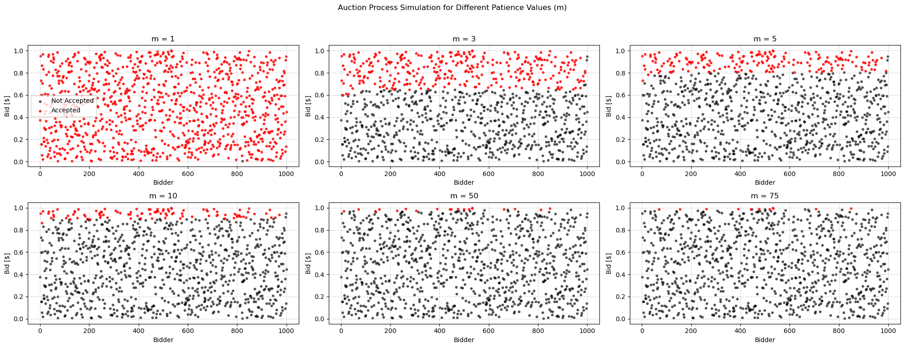

# README.md

## 1. Introducción

Este proyecto tiene como objetivo explorar, mediante simulaciones, el comportamiento de diferentes variantes del modelo de subasta con precio crítico desarrollado en Fraiman, D. (2022). El modelo original describe un mecanismo de subasta en el que el vendedor acepta la mejor oferta bajo ciertas reglas de paciencia y memoria, lo que da lugar a la aparición de un "precio crítico" característico.

En este trabajo se busca implementar una serie de modificaciones que tienen como objetivo analizar el impacto de distintos supuestos sobre el resultado de la subasta. El trabajo permite comparar los resultados empíricos obtenidos por simulación con los resultados teóricos, y entender cómo la dinámica de la subasta se ve afectada por cambios en las reglas de juego.

## 2. Modificaciones y variantes implementadas

A continuación se detallan las distintas variantes del modelo que fueron implementadas y analizadas en este trabajo.

### 2.1 Modelo original de Fraiman ("Modelo Fraiman")

Se implementa el modelo base propuesto en Fraiman, D. (2022), en el cual el vendedor recibe ofertas de forma secuencial, aceptando la oferta si es mayor a todas las ofertas que la preceden pero también mayor a la oferta posterior.

Este proceso es continuo en el tiempo, es decir, no hay una fecha límite para realizar las ofertas, lo que deriva en la aparición de un precio crítico que depende tanto de la distribución de las ofertas y de la regla de aceptación. Si la oferta es mayor a este precio, entonces tiene altas probabilidades de ser aceptada, y si es menor muy probablemente no lo sea.

Esta modelo lo utilizamos como punto de partida y referencia para comparar el efecto de las modificaciones posteriores.

### 2.2 Modificación de la paciencia del vendedor (parámetro m)

Se introduce un parámetro de paciencia $m$, que representa la cantidad de ofertas consecutivas que el vendedor está dispuesto a esperar antes de aceptar la oferta máxima. Es decir, el vendedor acepta la oferta únicamente si las $m$ ofertas posteriores son de menor valor.

Esta modificación nos permite analizar cómo la paciencia del vendedor influye en el precio crítico de venta y en la eficiencia del mecanismo de subasta. Se exploran diferentes valores de $m$ para observar su impacto en los resultados.

#### 2.2.1 Resultados

Lo que podemos ver en la Figura 1 es que, cuanto mayor sea la paciencia del vendedor, mayor es el precio crítico que se genera. Esto tiene sentido porque si $m>>0$, entonces para que una oferta sobreviva tiene que tener un valor lo suficientemente alto tal que siga siendo la oferta de máximo valor dentro de todas las demás.

Esto también nos muestra existe un trade-off entre la cantidad de unidades que se terminan vendiendo y la paciencia del vendedor. Si el vendedor tiene poca paciencia ($m$ bajo), entonces vende muchas unidades del producto. Por otro lado, si el vendedor tiene mucha paciencia ($m$ alto), entonces vende pocas unidades. 

### 2.3 Memoria finita del vendedor

En esta variante, el vendedor solo recuerda las últimas `k` ofertas pendientes para determinar el máximo, en lugar de tener memoria perfecta. Esto simula una limitación de información, y permite estudiar cómo la restricción de memoria afecta la probabilidad de alcanzar el precio crítico y la eficiencia del mecanismo. Se observa que una memoria más corta puede llevar a decisiones subóptimas y a una mayor variabilidad en los precios de venta.

### 2.4 Paciencia finita del comprador

Aquí se introduce la posibilidad de que los compradores tengan una paciencia limitada, es decir, que cada oferta tiene una vida útil $\tau$. Si la oferta no es aceptada en ese tiempo, el comprador se retira y su oferta deja de estar disponible. Se exploran tanto valores fijos como aleatorios de paciencia para los compradores, lo que añade realismo al modelo y permite analizar cómo la impaciencia de los compradores afecta el precio de venta y la dinámica de la subasta.

### 2.5 Impaciencia del vendedor

En esta modificación, el vendedor también puede tener impaciencia, vendiendo automáticamente tras un número fijo de pasos, aunque no se haya alcanzado el precio crítico. Esto modela situaciones en las que el vendedor tiene una urgencia temporal o una necesidad de liquidez, y permite analizar cómo la presión temporal afecta las decisiones y los resultados de la subasta.

### 2.6 Precio de reserva dinámico

Se introduce un precio de reserva que puede decaer con el tiempo o actualizarse en función de las ventas previas. Esta variante añade una capa adicional de realismo y complejidad al modelo, permitiendo simular escenarios en los que el vendedor ajusta sus expectativas de precio en función del contexto o de la historia de la subasta.

## 3. Conclusión y resultados

El análisis de las distintas variantes del modelo de Fraiman permitió obtener una visión integral sobre cómo las reglas de paciencia, memoria y precios de reserva afectan el resultado de la subasta y el precio crítico observado. Entre los principales hallazgos se destacan:
- Aumentar la paciencia del vendedor (`m`) tiende a incrementar el precio mínimo de venta, pero con rendimientos decrecientes a medida que `m` crece. Sin embargo, una paciencia excesiva puede llevar a demoras innecesarias en la venta.
- Limitar la memoria del vendedor reduce la eficiencia del mecanismo, ya que puede perder oportunidades de venta óptimas y tomar decisiones subóptimas debido a la falta de información completa.
- La paciencia finita de los compradores introduce una mayor dispersión en los precios de venta y puede reducir el precio mínimo alcanzado, ya que algunas buenas ofertas pueden expirar antes de ser aceptadas.
- La impaciencia del vendedor y la introducción de precios de reserva dinámicos permiten modelar escenarios más realistas, mostrando cómo la presión temporal y la adaptación de expectativas afectan las decisiones y los resultados.

En conjunto, estas simulaciones muestran la robustez y flexibilidad del modelo de Fraiman, así como la importancia de los parámetros de paciencia y memoria en el diseño de mecanismos de subasta eficientes. El trabajo realizado en la notebook permite no solo validar los resultados teóricos, sino también explorar nuevas preguntas y escenarios relevantes para la teoría de subastas y la economía experimental.

### Bibliografía

- Fraimain, D. (2022). A self-organized criticality participative pricing mechanism for selling zero-marginal cost products. Chaos, Solitons and Fractals, 158(2022). https://doi.org/10.1016/j.chaos.2022.112028.