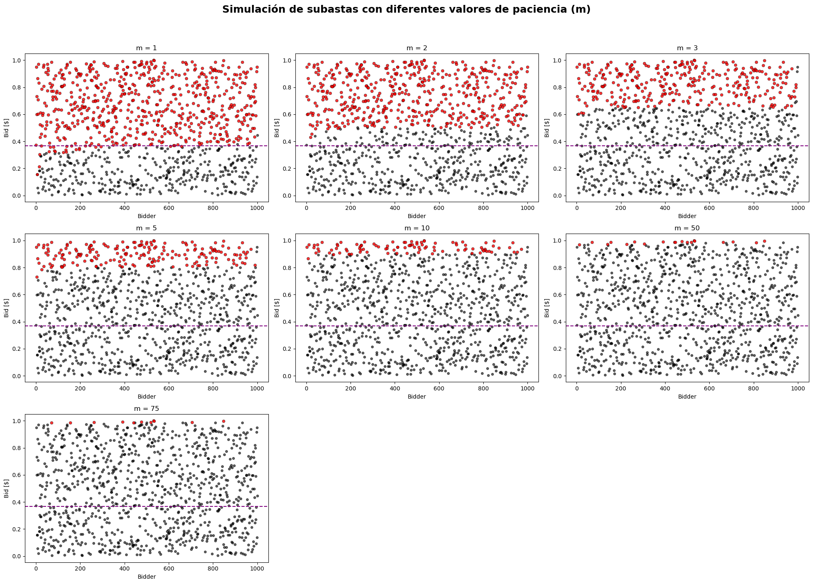
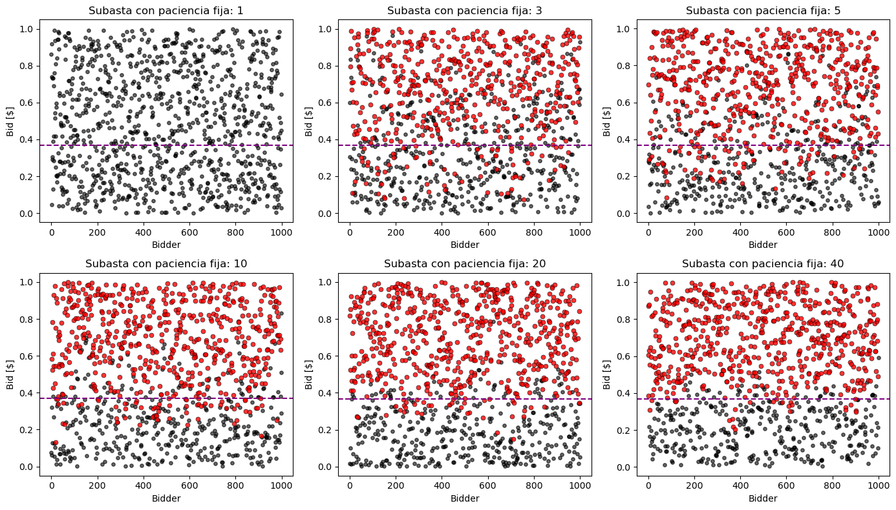

# Simulación de Subastas con Precio Crítico: Análisis de Variantes del Modelo SOC

## 1. Introducción

Este trabajo tiene como objetivo explorar, mediante simulaciones, el comportamiento de diferentes variantes del modelo de subasta con precio crítico desarrollado por Fraiman (2022). El modelo original describe un mecanismo de subastas en el cual el vendedor acepta la mejor oferta bajo ciertas reglas de paciencia y memoria, lo que da lugar a la aparición de un "precio crítico" característico.

A continuación vamos a aplicar una serie de modificaciones que nos permiten analizar el impacto de distintos supuestos sobre el resultado de la subasta. El estudio permite comparar los resultados empíricos obtenidos mediante simulaciones con los resultados teóricos y comprender cómo la dinámica de la subasta se ve afectada por cambios en las reglas del juego.

## 2. Modificaciones y variantes implementadas

A continuación se detallan las distintas variantes del modelo que fueron implementadas y analizadas en este trabajo.

### 2.1 Modelo original SOC

Se implementa el modelo base propuesto por Fraiman (2022), en el cual el vendedor recibe ofertas de forma secuencial, aceptando la oferta si esta es mayor que todas las ofertas precedentes, pero también mayor a la oferta posterior.

Este proceso es continuo en el tiempo, es decir, no hay una fecha límite para realizar las ofertas, lo que resulta en la aparición de un precio crítico que depende tanto de la distribución de las ofertas como de la regla de aceptación. Si la oferta es mayor que este precio crítico, entonces tiene altas probabilidades de ser aceptada; si es menor, muy probablemente será rechazada.

Este modelo se utiliza como punto de partida y referencia para comparar el efecto de las posteriores modificaciones.

### 2.2 Paciencia finita del vendedor

Se modifica el parámetro de paciencia $m$, el cual representa la cantidad de ofertas consecutivas que el vendedor está dispuesto a esperar antes de aceptar la oferta máxima. Es decir, el vendedor acepta la oferta únicamente si las $m$ ofertas posteriores son de menor valor.

En Fraiman (2022), el parámetro de paciencia está definido como $m=1$, lo que significa que la oferta se acepta solo si el precio de la siguiente es menor. Modificar este parámetro nos permite analizar cómo la paciencia del vendedor influye en el precio crítico de venta y en la eficiencia del mecanismo de subasta. Se exploran diferentes valores de $m$ para observar su impacto en los resultados.

#### 2.2.1 Algoritmo

```pseudocode
INPUT: 
    bids[] - lista con las ofertas generadas
    m - máxima cantidad de ofertas que el vendedor está dispuesto a esperar

VARIABLES:
    accepted_bids[] - lista con las ofertas aceptadas
    non_accepted_bids[] - lista con las ofertas rechazadas
    pending_bids[] - lista con las ofertas pendientes
    max_bid - mejor oferta hasta el momento
    counter - cantidad de ofertas desde que se generó la mejor
    
BEGIN
    FOR EACH bid IN bids[] DO
        // Step 1: Iterate over each generated offer
        
        // Step 2: Add the offer to the pending list
        ADD bid TO pending_bids[]
        
        // Step 3: If there is more than one pending offer
        IF SIZE(pending_bids) > 1 THEN
            // Step 3.1: Find the maximum offer among pending ones
            max_bid ← MAXIMUM(pending_bids)
            
            // Step 3.2: Increment counter of elapsed offers
            counter ← counter + 1
            
            // Step 3.3: Check if the offer should be accepted
            IF counter > m THEN
                ACCEPT max_bid
                REMOVE max_bid FROM pending_bids[]
                counter ← 0  // Reset counter
            END IF
        END IF
    END FOR
    
    // Step 4: Reject all remaining pending offers
    FOR EACH bid IN pending_bids[] DO
        REJECT bid
    END FOR
END
```

#### 2.2.2 Resultados

En la Figura 1.1 se observa que cuanto mayor sea la paciencia del vendedor, mayor es el precio crítico que se genera. Esto tiene sentido porque, si $m \gg 0$, una oferta es aceptada si y solo si tiene un precio lo suficientemente alto tal que ninguna de las $m$ ofertas que le siguen la supere.

<figure>
    <figcaption><b>Figura 1.1.</b> Precio crítico del vendedor para diferentes niveles de paciencia.</figcaption>
    
</figure>

Los resultados también muestran que existe un trade-off entre la cantidad de unidades que se venden y la paciencia del vendedor. Si el vendedor tiene poca paciencia ($m$ bajo), entonces acepta una proporción alta de las ofertas. Sin embargo, si el vendedor es muy paciente ($m$ alto), entonces acepta pocas ofertas. Este trade-off se puede observar en detalle en la Figura 1.2.

<figure>
    <figcaption><b>Figura 1.2.</b> Proporción de ventas realizadas según la paciencia del vendedor.</figcaption>
    
</figure>  

La Figura 1.3 muestra los histogramas de las ofertas aceptadas para subastas con distintos valores de $m$. Se observa que cuando $m=1$, el precio mínimo de venta es $\sim 0.356$, es decir, el precio crítico encontrado en Fraiman (2022). Sin embargo, a medida que el vendedor se vuelve más paciente (incrementa $m$), el precio mínimo de venta aumenta.

<figure>
    <figcaption><b>Figura 1.3.</b> Histograma de subastas para distintos niveles de paciencia del vendedor.</figcaption>
    
</figure>

Finalmente, se realizó un análisis de ley de potencias, del cual se obtuvo un exponente cercano a $-0.98$, lo que sugiere una relación hiperbólica inversa. Esto indica que el comportamiento del vendedor en la subasta es predecible y sigue una ley matemática simple. En particular, cada vez que el vendedor duplica su paciencia, la cantidad de ofertas aceptadas se reduce a la mitad.

<figure>
    <figcaption><b>Figura 1.4.</b> Análisis de ley de potencias para las subastas.</figcaption>
    
</figure>


**Tabla 1.** Cantidad total, promedio e ingreso total por ventas para cada valor de $m$.
| m   | Q_vendida | P_promedio_vendido  | Ingreso_total |
|-----|-----------|---------------------|---------------|
| 1   | 635       | 0.673445            | 427.637560    |
| 2   | 498       | 0.744411            | 370.716582    |
| 3   | 329       | 0.829282            | 272.833654    |
| 5   | 197       | 0.899204            | 177.143133    |
| 10  | 98        | 0.947085            | 92.814330     |
| 50  | 19        | 0.986173            | 18.737289     |
| 75  | 11        | 0.991197            | 10.903166     |


### 2.3 Memoria finita del vendedor

En esta variante, en lugar de tener memoria perfecta, el vendedor solo recuerda las últimas $k$ ofertas pendientes. Esto simula una limitación de información por parte del vendedor y permite entender cómo la capacidad de memoria puede afectar la probabilidad de alcanzar el precio crítico y la eficiencia del mecanismo.

#### 2.3.1 Algoritmo

```pseudocode
INPUT: 
    bids[] - lista con todas las ofertas generadas
    K - máximo numero de ofertas que se pueden mantener en memoria

VARIABLES:
    pending_bids[] - lista de ofertas en abiertas
    maximum_bid - oferta de mayor valor de las K disponibles
    
BEGIN
    FOR EACH bid IN bids[] DO
        // Step 1: Iterate over all bids
        
        // Step 2: If there are no pending bids, add current bid as pending
        IF SIZE(pending_bids) = 0 THEN
            ADD bid TO pending_bids[]
        
        // Step 3: If there's more than one pending bid
        ELSE IF SIZE(pending_bids) > 1 THEN
            // Step 3.1: Keep only the last K bids (finite memory)
            WHILE SIZE(pending_bids) > K DO
                REMOVE FIRST_ELEMENT FROM pending_bids[]
            END WHILE
            
            // Step 3.2: Search for the maximum bid in the last K bids
            maximum_bid ← MAXIMUM(pending_bids)
            
            // Step 3.3: If current bid is lower than max, accept it and update pending list
            IF bid < maximum_bid THEN
                ACCEPT maximum_bid
                REMOVE maximum_bid FROM pending_bids[]
                ADD bid TO pending_bids[]
            ELSE
                ADD bid TO pending_bids[]
            END IF
        ELSE
            // Only one pending bid, just add the current one
            ADD bid TO pending_bids[]
        END IF
    END FOR
END
```

#### 2.3.2 Resultados

Se observa en la Figura 2 cómo la memoria del vendedor afecta al precio de referencia. Para valores de $k$ bajos, el vendedor recuerda solo unas pocas ofertas, lo que dificulta la generación de un precio crítico como en el modelo original. El precio crítico se aprecia con mayor claridad a medida que se incrementa la memoria.

<figure>
    <figcaption><b>Figura 2.</b> Resultados de las subastas para distintos valores de memoria del vendedor. La línea punteada representa el precio crítico encontrado en Fraiman, D. (2022).</figcaption> 
    
</figure>

**Tabla 2.** Memoria finita: Cantidad, precio promedio e ingreso total para una memoria de 5 ofertas.
| Q_vendida | P_promedio_vendido  | Ingreso_total |
|-----------|---------------------|---------------|
| 614       | 0.680279            | 417.691022    |

### 2.4 Paciencia finita del comprador

Se introduce la posibilidad de que los compradores tengan una paciencia limitada, es decir, que cada oferta tenga una vida útil $\tau$. Si la oferta no es aceptada en ese tiempo, el comprador se retira y su oferta deja de estar disponible.

Se exploran tanto valores fijos como aleatorios para la paciencia de los compradores con el objetivo de analizar cómo esto afecta la dinámica de la subasta.

#### 2.4.1 Algoritmo

A continuación se detalla la implementación del algoritmo cuando el comprador tiene paciencia fija (i.e., fijamos la cantidad de ofertas que un comprador espera para retirarse).

```pseudocode
INPUT: 
    bids[] - lista con todas las ofertas generadas
    tau - tiempo máximo que una oferta puede permanecer activa

VARIABLES:
    pending_bids[] - lista de ofertas abiertas con sus índices
    sold_bids[] - lista de ofertas que se vendieron  
    expired_bids[] - lista de ofertas que expiraron
    current_time - tiempo actual (índice de la oferta actual)
    champion - oferta con mayor valor entre las pendientes
    
BEGIN
    FOR EACH bid IN bids[] WITH INDEX i DO
        current_time ← i
        
        // Step 1: Remove expired bids that lost patience
        FOR EACH pending_bid IN pending_bids[] DO
            IF (current_time - pending_bid.index) >= tau THEN
                ADD pending_bid TO expired_bids[]
                REMOVE pending_bid FROM pending_bids[]
            END IF
        END FOR
        
        // Step 2: Create new bid object with current time and value
        new_bid ← CREATE_BID(current_time, bid)
        
        // Step 3: If no pending bids, add current bid as pending
        IF SIZE(pending_bids) = 0 THEN
            ADD new_bid TO pending_bids[]
            CONTINUE
        END IF
        
        // Step 4: Find the maximum bid among pendings
        maximum_bid ← MAXIMUM(pending_bids[], key=bid_value)
        
        // Step 5: Sell if new bid is lower than maximum_bid
        IF new_bid.bid < maximum_bid.bid THEN
            ADD maximum_bid TO sold_bids[]
            REMOVE maximum_bid FROM pending_bids[]
        END IF
        
        // Step 6: Add new bid to pending list
        ADD new_bid TO pending_bids[]
    END FOR
END
```

#### 2.4.2 Resultados con paciencia $\tau$ fija

La Figura 3 muestra cómo se genera el precio crítico a medida que aumenta la paciencia del comprador, es decir, crece $\tau$, acercándose más a la configuración original.

El caso extremo de $\tau = 1$ muestra que cuando el comprador no tiene paciencia, no se vende ninguna unidad. Esto ocurre porque el vendedor siempre espera a que llegue una nueva oferta para aceptar la oferta actual, pero en este caso el comprador desea que su oferta se acepte inmediatamente, lo que impide que ocurra alguna venta.

<figure>
    <figcaption><b>Figura 3.</b> Resultados de las subastas para distintos valores de paciencia del comprador. La línea punteada representa el precio crítico encontrado en Fraiman, D. (2022).</figcaption>
    
</figure>

**Tabla 3.** Impaciencia del comprador: Cantidad, precio promedio e ingreso total con $\tau = 10$.
| Q_vendida | P_promedio_vendido  | Ingreso_total |
|-----------|---------------------|---------------|
| 594       | 0.673577            | 400.104964    |

#### 2.4.3 Resultados con paciencia $\tau$ aleatoria para cada comprador

Se define ahora la paciencia $\tau$ del comprador utilizando una distribución exponencial. Los resultados mostrados en la Figura 4 son similares a los obtenidos con paciencia fija para el comprador.

<figure>
    <figcaption><b>Figura 4.</b> Resultados de las subastas con paciencia aleatoria del comprador. La línea punteada representa el precio crítico encontrado en Fraiman, D. (2022).</figcaption>
    
</figure>

**Tabla 4.** Impaciencia del comprador variable: Cantidad, precio promedio e ingreso total para $\lambda =10$
| Q_vendida | P_promedio_vendido  | Ingreso_total |
|-----------|---------------------|---------------|
| 555       | 0.656938            | 364.600756    |

### 2.5 Impaciencia del vendedor - Precio de reserva dinámico

Se introduce un precio de reserva que se actualiza en función de las ventas realizadas. Cuanto más tiempo debe esperar el vendedor para aceptar una oferta, el precio de reserva disminuye y, por lo tanto, aumentan las probabilidades de aceptar la oferta candidata. De esta manera se puede modelar de forma dinámica la impaciencia del vendedor.

Esta variante añade una capa adicional de realismo y complejidad al modelo, permitiendo simular escenarios en los que la impaciencia del vendedor se ajusta en función del contexto o de la historia de la subasta.

#### 2.5.1 Algoritmo

```pseudocode
INPUT: 
    bids[] - lista con las ofertas generadas
    decay_rate - factor de decaimiento de la impaciencia
    N - cantidad de ofertas

VARIABLES:
    pending_bids[] - lista con las ofertas pendientes
    accepted_bids[] - lista con las ofertas aceptadas
    accepted_indices[] - lista con los índices de las ofertas aceptadas
    highest_pending_bid - oferta máxima dentro de las pendientes
    impatience_threshold - umbral de impaciencia del vendedor (precio de reserva)
    last_sale - índice (momento) de la última venta
    first_sale - indica si es la primer venta
    current_index - índice (momento) actual
    sell - indica si se acepta la oferta o no
    
BEGIN
    INITIALIZE pending_bids[] as empty array
    INITIALIZE accepted_bids[] as empty array
    INITIALIZE accepted_indices[] as empty array
    SET last_sale ← NULL
    SET first_sale ← TRUE
    
    FOR current_index FROM 1 TO N DO
        current_bid ← bids[current_index]
        
        // If no pending bids, add current bid and continue
        IF pending_bids[] is empty THEN
            ADD current_bid TO pending_bids[]
            CONTINUE
        END IF
        
        SET highest_pending_bid ← max(pending_bids[])
        SET impatience_threshold ← calculate_decreasing_threshold()
        
        // SELLING LOGIC (logical OR)
        SET sell ← FALSE
        
        // Rule 1: Original structure
        IF current_bid < highest_pending_bid THEN
            SET sell ← TRUE
        END IF
        
        // Rule 2: Seller impatience  
        IF NOT sell AND highest_pending_bid >= impatience_threshold THEN
            SET sell ← TRUE
        END IF
        
        IF sell THEN
            // SALE: always the highest pending bid
            ADD highest_pending_bid TO accepted_bids[]
            ADD index_of(highest_pending_bid) TO accepted_indices[]
            REMOVE highest_pending_bid FROM pending_bids[]
            ADD current_bid TO pending_bids[]
            SET last_sale ← current_index
        ELSE
            // Do not sell
            ADD current_bid TO pending_bids[]
        END IF
    END FOR
    
    RETURN accepted_bids[], accepted_indices[]
END
```

#### 2.5.2 Resultados

En la Figura 5 se observa cómo se ajusta el precio de reserva (umbral de impaciencia) del vendedor a medida que debe esperar más para vender la siguiente unidad.

Como se puede ver en el gráfico de dispersión, incorporar el precio de reserva logra que el vendedor venda unidades por debajo del precio crítico.

<figure>
    <figcaption><b>Figura 5.</b> Resultados de las subastas con precio de reserva del vendedor. La línea punteada representa el precio crítico encontrado en Fraiman, D. (2022).</figcaption>
    
</figure>

**Tabla 5.** Impaciencia del Vendedor: Cantidad, precio promedio, ingreso total y umbrales.
| Q_vendida | P_promedio_vendido  | Ingreso_total | Umbral_min | Umbral_max | Umbral_promedio |
|-----------|---------------------|---------------|------------|------------|-----------------|
| 710       | 0.635526            | 451.223462    | 0.367879   | 0.652305   | 0.459568        |


## 3. Conclusiones y resultados

En este trabajo se analizaron diferentes variantes del modelo de Fraiman (2022), lo que permitió obtener una visión integral sobre cómo las reglas de paciencia, memoria y precios de reserva afectan el resultado de la subasta y el precio crítico observado. Entre los principales hallazgos se destacan:

- **Paciencia del vendedor**: Aumentar la paciencia del vendedor ($m$) tiende a incrementar el precio mínimo de venta. Además, cuando el vendedor es muy paciente ($m \gg 0$), se observan demoras innecesarias para aceptar las ofertas y menores ventas.

- **Memoria limitada**: Limitar la memoria del vendedor reduce la eficiencia del mecanismo, ya que puede perder oportunidades de venta óptimas.

- **Paciencia de compradores**: La paciencia finita de los compradores introduce una mayor dispersión en los precios de venta, ya que algunas buenas ofertas pueden expirar antes de ser aceptadas.

- **Precio de reserva dinámico**: La impaciencia del vendedor y la introducción de precios de reserva dinámicos permiten modelar escenarios más realistas, mostrando cómo la presión temporal y la adaptación de expectativas afectan las decisiones y los resultados.

En conjunto, los estudios realizados demuestran la robustez y flexibilidad del modelo presentado por Fraiman (2022), así como la importancia de los parámetros de paciencia y memoria en el diseño de mecanismos de subasta eficientes.

### Bibliografía

- Fraiman, D. (2022). A self-organized criticality participative pricing mechanism for selling zero-marginal cost products. *Chaos, Solitons and Fractals*, 158, 112028. https://doi.org/10.1016/j.chaos.2022.112028
